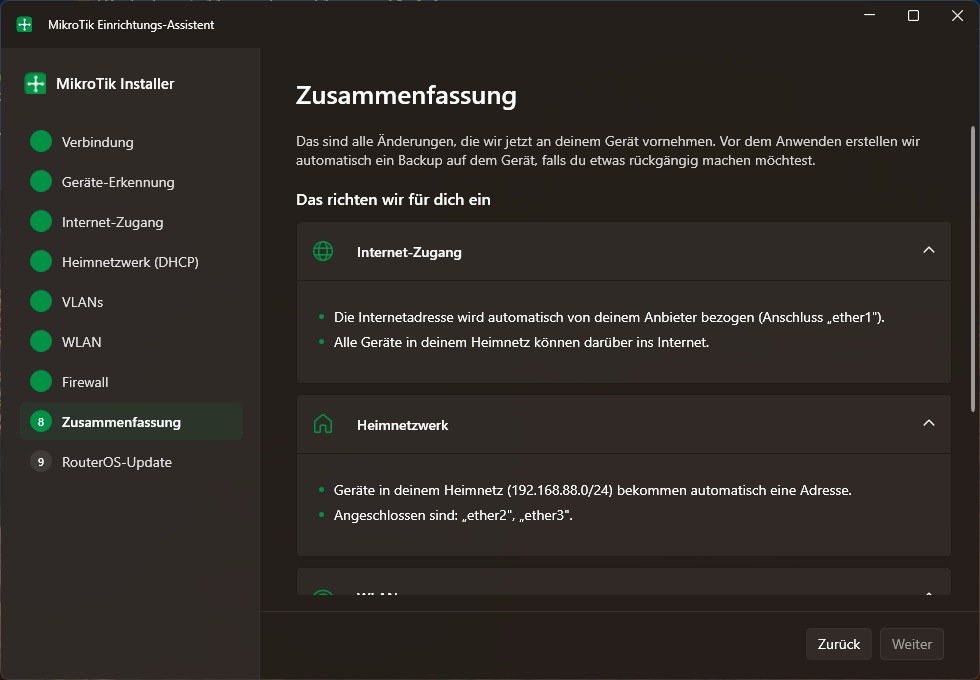

# MikroTik Installer

[](LICENSE)

Ein Windows-Programm, mit dem sich MikroTik-Router/-Switches in wenigen, klar geführten Schritten einrichten lassen – auch ohne Netzwerk-Vorkenntnisse. Statt WinBox-Menüs und RouterOS-Fachbegriffen gibt es ein Interview: Verbindung herstellen, ein paar verständliche Fragen beantworten, fertig.

> **Hinweis:** Dies ist ein unabhängiges, privates Open-Source-Projekt ohne jede kommerzielle Absicht. Es steht in keiner Verbindung zu MikroTik und wird nicht von MikroTik unterstützt, gesponsert oder geprüft. Siehe [Markenrechte & Haftungsausschluss](#markenrechte--haftungsausschluss).



## Was der Assistent einrichtet

Schritt für Schritt, mit Erklär-Tooltips (ⓘ) bei jedem Fachbegriff:

1. **Verbindung** – IP-Adresse, Benutzername, Passwort
2. **Geräte-Erkennung** – liest Modell, RouterOS-Version und Schnittstellen aus
3. **Internet-Zugang** – WAN-Schnittstelle, DHCP oder feste IP, NAT
4. **Heimnetzwerk (DHCP)** – Bridge, IP-Bereich, DHCP-Server, DNS
5. **VLANs** *(optional)* – zusätzliche, getrennte Netzwerke (z. B. Gäste, IoT)
6. **WLAN** *(übersprungen, wenn nicht vorhanden – oder bewusst abwählbar, z. B. bei einem reinen Switch)*
7. **Firewall** – sichere Basisregeln, optionale Portfreigaben
8. **Zusammenfassung** – alle geplanten Änderungen im Klartext, automatisches Backup auf dem Gerät vor dem Anwenden, **PDF-Export** mit allen Zugangsdaten inkl. WLAN-QR-Code zum Ausdrucken/Aufbewahren
9. **RouterOS-Update** *(optional)* – prüft auf eine neuere RouterOS-Version und kann sie mit deutlicher Warnung starten

Nichts wird am Gerät verändert, bevor der Nutzer in der Zusammenfassung ausdrücklich auf „Jetzt einrichten“ klickt.

## Für Nutzer

- Windows 10/11, keine Installation nötig
- Einfach `MikroTik-Installer.exe` herunterladen und starten – eine einzelne, eigenständige Datei (~67 MB), kein separates .NET muss installiert werden
- Portable: läuft von jedem Ordner/USB-Stick, schreibt nichts in Registry oder AppData

### Ist die Datei vertrauenswürdig?

Jede Version wird nicht lokal, sondern öffentlich nachvollziehbar per GitHub Actions direkt aus diesem Quellcode gebaut (siehe `.github/workflows/release.yml`) – niemand fügt der exe manuell etwas hinzu. Bei jedem [Release](../../releases) findest du zusätzlich:

- eine **`.sha256`-Prüfsumme** neben der exe, mit der du die Integrität deines Downloads überprüfen kannst (`Get-FileHash MikroTik-Installer.exe -Algorithm SHA256` unter PowerShell)
- einen **VirusTotal-Scan-Link** in den Release-Notizen, der die exakt gebaute Datei durch 70+ Antiviren-Engines prüft

Die exe ist nicht mit einem kostenpflichtigen Code-Signing-Zertifikat signiert – Windows SmartScreen zeigt daher beim ersten Start ggf. „Unbekannter Herausgeber" an. Das ist bei kostenlosen Open-Source-Projekten ohne Firmenhintergrund normal und kein Hinweis auf Schadsoftware; über „Weitere Informationen" → „Trotzdem ausführen" lässt sich der Hinweis bestätigen.

## Für Entwickler

### Voraussetzungen

- [.NET 8 SDK](https://dotnet.microsoft.com/download/dotnet/8.0)

### Bauen & Testen

```powershell
dotnet build
dotnet test src/MikrotikInstaller.Core.Tests/MikrotikInstaller.Core.Tests.csproj
dotnet run --project src/MikrotikInstaller.App
```

### Release-Build (eine einzelne .exe)

```powershell
.\build-release.ps1
```

Erzeugt `src/MikrotikInstaller.App/bin/Release/net8.0-windows/win-x64/publish/MikroTik-Installer.exe` – self-contained, single-file, ohne .NET-Runtime-Installation beim Nutzer.

Es gibt außerdem einen Gitea-Actions-Workflow (`.gitea/workflows/build.yml`), der das bei jedem Push automatisch übernimmt – vorausgesetzt, ein passender Runner ist auf der Gitea-Instanz registriert.

### Interner Testzugang (nur Debug-Builds)

Im Verbindungs-Schritt aktiviert die Kombination `127.127.127.127` / `admin` / `admin` einen komplett simulierten Router (kein echtes Gerät nötig, keine Netzwerkverbindung) – damit lässt sich der gesamte Assistent gefahrlos durchklicken. Dieser Zugang ist per `#if DEBUG` ausgeschlossen und existiert in veröffentlichten Release-Builds nicht.

### Projektstruktur

```
src/
  MikrotikInstaller.App/          WPF-UI (Views, ViewModels, Wizard-Shell)
  MikrotikInstaller.Core/         RouterOS-Clients, Konfigurationslogik, PDF-Export
  MikrotikInstaller.Core.Tests/   Unit-Tests für Core (xUnit)
```

**Core** kapselt die gesamte RouterOS-Kommunikation hinter `IRouterOsClient` – wahlweise über die REST-API (RouterOS 7+) oder die binäre API (Port 8728/8729, ältere Geräte), mit automatischem Fallback. Jede Konfigurations-Funktion (WAN, LAN, VLAN, WLAN, Firewall) erzeugt sowohl die auszuführenden RouterOS-Befehle als auch eine laienverständliche Klartext-Zusammenfassung.

**App** ist reines MVVM: Ein generischer Wizard-Shell (`MainViewModel`) navigiert durch eine Liste von Schritt-ViewModels; Schritte ohne Inhalt für das jeweilige Gerät (z. B. WLAN ohne WLAN-Hardware) werden automatisch übersprungen.

### Verwendete Bibliotheken

- [WPF-UI](https://github.com/lepoco/wpfui) – modernes Fluent-Design für WPF
- [CommunityToolkit.Mvvm](https://github.com/CommunityToolkit/dotnet) – MVVM-Grundgerüst
- [PDFsharp](https://github.com/empira/PDFsharp) – PDF-Erzeugung
- [QRCoder](https://github.com/codebude/QRCoder) – WLAN-QR-Code

Die MikroTik-Markenfarbe (`#009245`) wurde aus der offiziellen Website übernommen; das App-Icon ist ein eigenes, neutrales Netzwerk-Symbol (kein MikroTik-Logo).

## Lizenz

Dieses Projekt steht unter der [MIT-Lizenz](LICENSE). Der Quellcode darf frei verwendet, verändert und weiterverbreitet werden – auch in eigenen (auch kommerziellen) Projekten –, solange der Lizenz- und Copyright-Hinweis erhalten bleibt. Die Software wird ohne jede Gewährleistung bereitgestellt („as is").

## Markenrechte & Haftungsausschluss

- **Kein offizielles MikroTik-Produkt.** Dieses Projekt ist eine unabhängige, private Entwicklung und steht in keiner Verbindung zu MikroTikls SIA. Es wird nicht von MikroTik entwickelt, geprüft, unterstützt, gesponsert oder in irgendeiner Form autorisiert.
- **Markenrechte bleiben unangetastet.** „MikroTik", „RouterOS", „WinBox" und alle weiteren genannten Produkt- und Markennamen sind Marken bzw. eingetragene Marken von MikroTikls SIA. Sie werden hier ausschließlich zur sachlichen Beschreibung der Kompatibilität verwendet (nominativer Gebrauch), nicht um eine Verbindung, Zusammenarbeit oder Billigung durch MikroTik zu suggerieren. Das App-Icon ist ein eigens erstelltes, neutrales Symbol – **kein** MikroTik-Logo.
- **Nicht-kommerzielles Hobbyprojekt.** Der Autor verfolgt mit diesem Projekt keinerlei finanzielle Absicht. Es wird kostenlos und ohne Gewinnerzielungsabsicht als Open Source zur Verfügung gestellt, in der Hoffnung, dass es anderen Nutzern beim Einrichten ihrer Geräte hilft.
- **Nutzung auf eigene Verantwortung.** Wer den Installer einsetzt, ändert Konfigurationen auf eigenen Netzwerkgeräten in eigener Verantwortung. Es wird keine Haftung für Schäden, Datenverlust oder Fehlkonfigurationen übernommen, die durch die Nutzung dieser Software entstehen (siehe auch Gewährleistungsausschluss in der [LICENSE](LICENSE)).

Sollte MikroTikls SIA Einwände gegen Inhalte dieses Repositories haben, bitte über die Kontaktmöglichkeiten dieses GitHub-Profils melden – entsprechende Inhalte werden umgehend angepasst oder entfernt.
